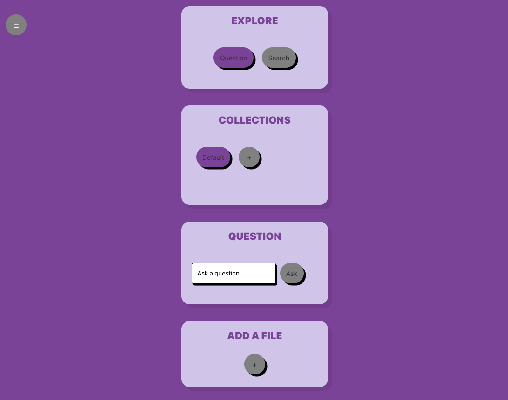

# What did I sign up for?

The purpose of this project is to provide a tool for understanding what you signed up for. I don't always read the terms of service / privacy policies when I sign up for online accounts. I wanted to create a tool for keeping track of these and making it easier to find the information I need when I need it.

You add files (ex. terms of service, privacy policy) and generate embeddings of segments of the documents in the file. These embeddings can be used for semantic search and to provide context for prompts to an llm for question answering. The segments included in the field of search can be filtered by collection.

See the live site at [npole.org](https://npole.org). You can select the active function (question or search) in the explore section, and you can select the active collection / create a new collection in the collections section. At the bottom you can add a file to the currently active collection by pasting a link in the field and clicking the submit button.

You can see the swagger page for the api at [api.npole.org/docs](https://api.npole.org/docs) and the authentication api at [auth.npole.org/docs](https://auth.npole.org/docs).

