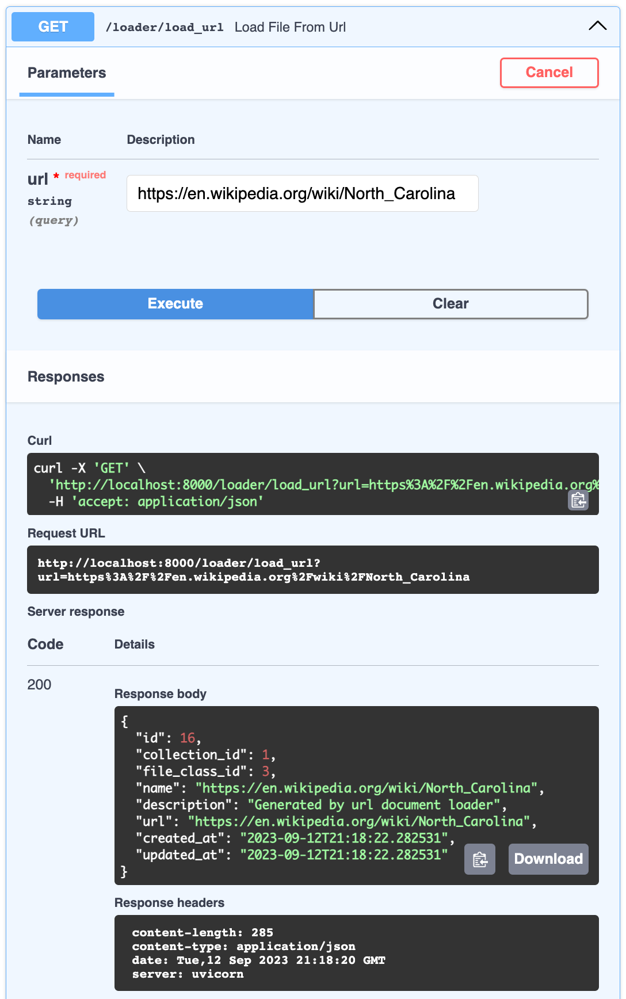
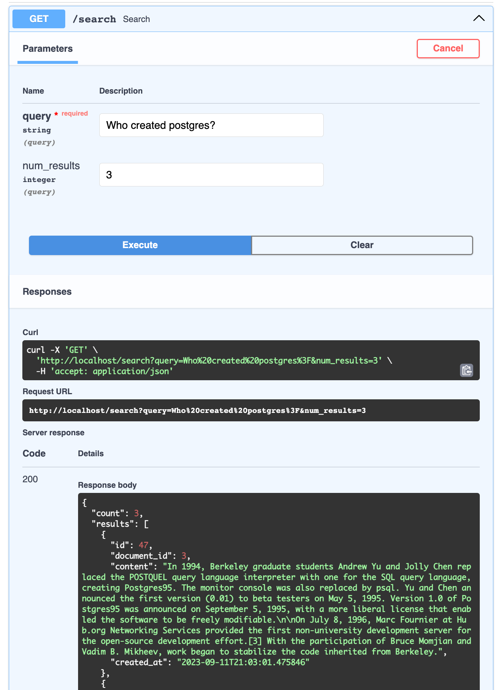
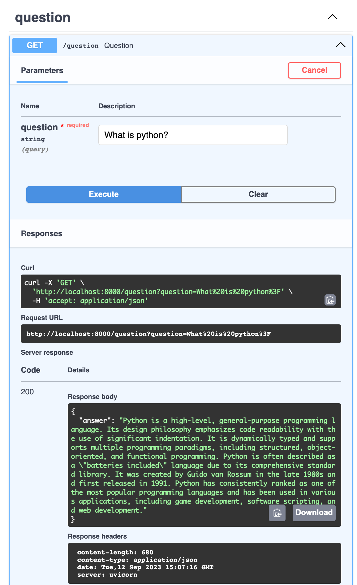
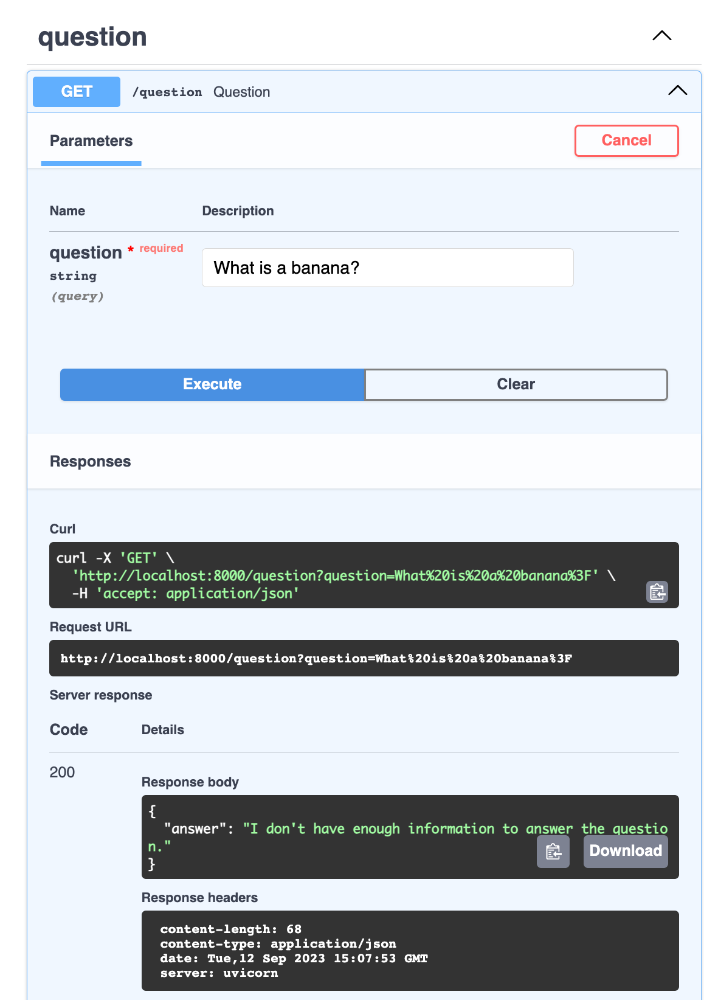
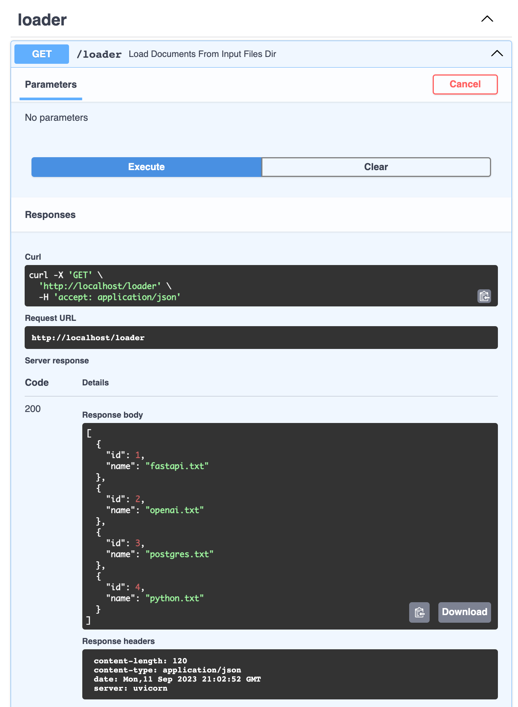

# What did I sign up for?

The purpose of this project is to provide a tool for understanding what you signed up for. You add files (ex. terms of service, privacy policy) and generate embeddings of segments of the documents in the file. These embeddings can be used for semantic search and to provide context for prompts to an llm for question answering. The segments included in the field of search can be filtered by file, collection, or file class. 

*See [the docs](./docs/index.md).*

[](https://github.com/danfred360/what_did_i_sign_up_for/actions/workflows/github-code-scanning/codeql)

## quickstart
1. Create the `app.env` and `vectordb.env` files in the `deploy` directory. See the `app.env.example` and `vectordb.env.example` files for the required environment variables.

The `POSTGRES_PASSWORD` in the `vectordb.env` file sets the password in the postgres container, so this should match the `POSTGRES_PASSWORD` in the `app.env` file.

You will also need to add your openai api key to the `app.env` file.

2. Run api and vectordb with docker compose
```bash
cd deploy
docker compose up
```
Access swagger page at [localhost](http://localhost).

3. Send a `GET` request to localhost/loader/load_url with the url of the file to load. This will return the id of the file that can be used in the next steps for semantic search and question answering using only that file.



4. Send a `GET` request to localhost/search with the query in the url params to preform a global search (include all files in context). You can also search by collection, file class, file, and document.



You can also send a `GET` request to localhost/question to ask chatgpt a question about all of the loaded files. You can also specify the collection, file class, file, or document to search in.



If the question cannot be answered based on the documents, the response will be `I don't have enough information to answer the question.`


## load documents from input directory
1. Add documents to the `deploy/input_files` directory. The directory structure is as follows:
```
input_files
├── collection
│   ├── file_class
│   │   ├── file
│   │   │   ├── document
```
For example, to add a terms of service document for x.com, add the text file to `input_files/x/terms_of_service/x_terms_of_service/terms_of_service.txt`.

The collection name, file name, and document name will be inferred from the directory structure. The possible file classes are `terms_of_service`, `privacy_policy`, and `other`. Any other name for the file_class directory will be added as `other`.

2. Send a `GET` request to localhost/loader to trigger the document loader.



The response contains a list of ids and names of the documents that were added.