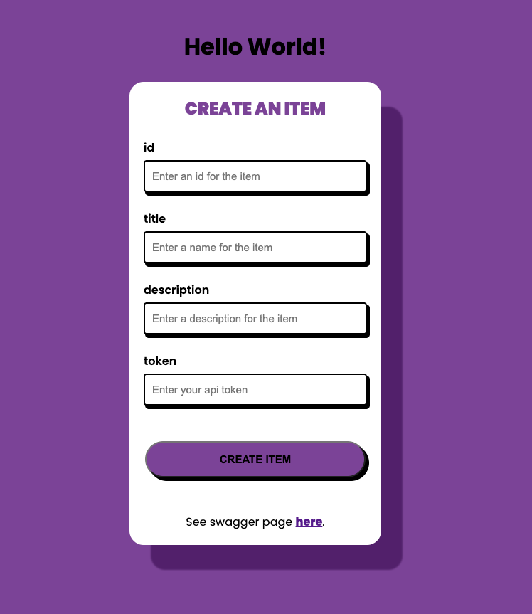

# What did I sign up for?

*See what's [in progress](./in_progress.md).*

The purpose of this project is to provide a tool for understanding what you signed up for. You add files (ex. terms of service, privacy policy) and generate embeddings of segments of the documents in the file. These embeddings can be used for semantic search and to provide context for prompts to an llm for question answering. The segments included in the field of search can be filtered by file, collection, or file class. 

**Table of Contents**
- [terms](#terms)
- [quickstart](#quickstart)
- [local developement](#local-developement)
    - [app](#app)
    - [vectordb](#vectordb)
    - [build docker containers locally](#build-docker-containers-locally)
- [static site](#static-site)
- [resources](#resources)

## terms
### collection
A collection is a group of files. For example, you may have a collection of files related to a specific service or product. You may also have a collection of files related to a specific company. A collection may have a parent collection.

### file class
A file class is a group of files that share a common structure or serve a similar purpose. For example, you may have a file class for terms of service documents.

### file
A file is a document that you want to understand. It has a name, a collection, a file class, and a source url. It is made up of documents.

### document
A document is a component of a file. It could be a page from a terms of service webpage or a page from a privacy policy pdf. A document is made up of segments.

### segment
A segment is a component of a document that is used to generate embeddings. The text contents of the segment are stored as an embedding, in addition to additional embeddings used for searching (ex. an embedding of a list of questions that the segment answers that was generated by an llm.)

## quickstart
```bash
cd deploy
docker compose up
```

Access site at [localhost](http://localhost).

## local developement

### app
```bash
# initialize virtual environment
python -m venv venv
. venv/bin/activate

# install dependencies
pip install -r requirements.txt

# run
uvicorn app.main:app --reload
```

See swagger page [http://127.0.0.1:8000/docs](http://127.0.0.1:8000/docs).

local checks
```bash
# run tests
pytest app

# run linter
ruff check app
```

See [the app docs](./app/index.md) for more information.

### vectordb
```
cd vectordb
docker compose up
```

See [the vectordb docs](./vectordb/index.md) for more information.

### build docker containers locally
```bash
cd app
# build image
docker build -t app .

# run container
docker run -d --name app -p 80:80 app
```

## static site
I'd like the site to look like this. You can see the static site when the app is running at [localhost/staticapp](http://localhost/staticapp).



## resources
- https://fastapi.tiangolo.com/tutorial/testing/
- https://www.codewithfaraz.com/content/61/how-to-create-neobrutalism-sign-up-form-using-html-and-css-only
- https://betterstack.com/community/guides/logging/how-to-start-logging-with-python/