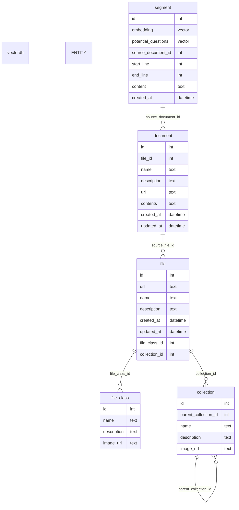

# vectordb

## local development
```bash
# start container
cd vectordb
docker compose up -d

# force rebuild container if making changes to Dockerfile or seed scripts
docker compose up -d --build --force-recreate --remove-orphans

# connect to running container
docker exec -it vectordb bash

# start psql utility
psql -h localhost -U postgres -d vectordb
```

useful psql commands:
```sql
-- list tables in database
\dt;

-- list columns in table
\d+ table_name;

-- select * from table
select * from table_name;

-- list indexes in table
\di+ table_name;

-- list functions in database
\df;

-- list triggers in database
\dft;
```

## schema

## resources
- [pgvector](https://github.com/pgvector/pgvector)
- https://neon.tech/docs/extensions/pgvector